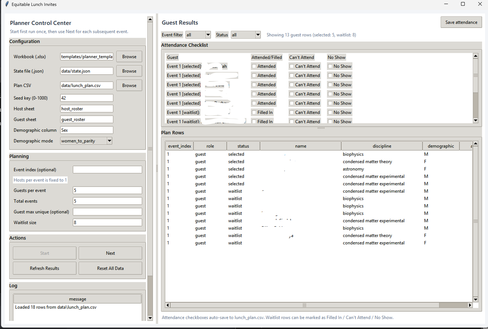

# equitable-lunch-invites

A small planner for running a series of lunches with fixed host and guest counts, while keeping rotation and representation fair. It reads one Excel workbook plus one seed key, then produces a reproducible plan and a persistent state file.

## GUI preview



Put your screenshot at `docs/gui.png`.

## Math specification

- Math explanation (PDF): [docs/explanation.pdf](docs/explanation.pdf)
- Validation report (PDF): [docs/Validation.pdf](docs/Validation.pdf)

## Equity rules

- Rotation fairness: fewer prior assignments rank higher.
- Reliability weighting: no-shows reduce future priority.
- Demographic balancing: each event corrects deficits against series targets.
- Discipline coverage: each event avoids discipline drop-out when possible.
- Deterministic reproducibility: same inputs + seed key yield the same plan.

## Input workbook

Provide one `.xlsx` with two sheets:

- `host_roster`: `Name`, `Discipline`
- `guest_roster`: `Name`, `Discipline`, `Sex` (or another demographic column)

Use `templates/planner_templates.xlsx` as the template.

If `Discipline` is blank, missing entries are auto-distributed evenly across all disciplines.

## Run the GUI

```bash
python main.py
